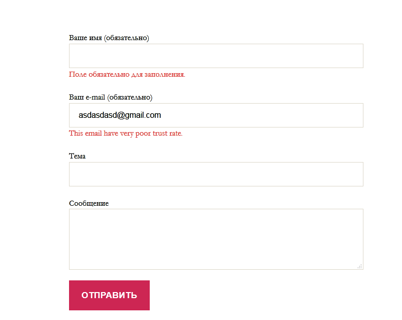
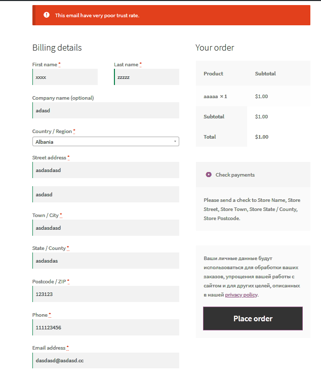

# MailCheck.co Wordpress plugin

Wordpress [plugin](https://wordpress.org/plugins/mailcheck-co/) that extends WP functionality with email validation.

That plugin integrates with:

1. Core WP
2. ACF Plugin
3. Contact Form 7
4. WooCommerce
5. Elementor
6. Mailpoet

## Core WP
Plugins add hook inside WP core that will reject low quality emails during processing. If you allow user registration 
at your site - it will be protected by MailCheck service, because it depends on WP Core.

## ACF Plugin
ACF have special filed type email, and it will be additionally validated

## Contact Form 7
If form have input with type `email` it will be validated.

## WooCommerce
User registration in WooCommerce also validated

## Elementor
AJAX form validation for Elementor based forms

## Mailpoet
Mailpoet forms validation
